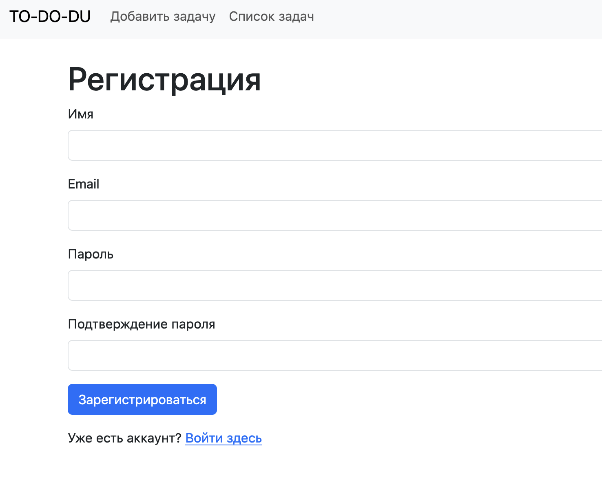
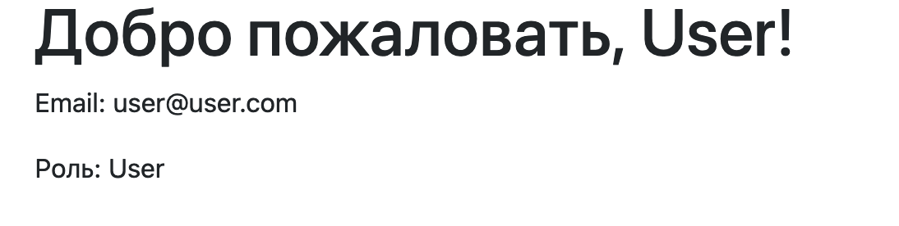

# lab5

## Введение

В этом отчете описаны все выполненные шаги по реализации аутентификации, авторизации, управления ролями пользователей и защиты от CSRF-атак в проекте Laravel с использованием базы данных SQLite.

## Шаги реализации

### 1. Аутентификация пользователей

#### 1.1 Создание контроллера `AuthController`

Создан контроллер `AuthController` с методами для регистрации, входа и выхода пользователя.

**Файл:** `app/Http/Controllers/AuthController.php`

```php
<?php

namespace App\Http\Controllers;

use Illuminate\Http\Request;
use Illuminate\Support\Facades\Auth;
use App\Models\User;
// Для хеширования паролей
use Illuminate\Support\Facades\Hash;
use App\Http\Requests\RegisterRequest;
use App\Http\Requests\LoginRequest;

class AuthController extends Controller
{
    // Отображение формы регистрации
    public function register()
    {
        return view('auth.register');
    }

    // Обработка данных формы регистрации
    public function storeRegister(RegisterRequest $request)
    {
        // Проверяем, является ли это первый пользователь
        $isFirstUser = User::count() === 0;

        // Создаем нового пользователя
        $user = User::create([
            'name' => $request->name,
            'email' => $request->email,
            'password' => Hash::make($request->password),
            'role' => $isFirstUser ? 'admin' : 'user',
        ]);

        // Выполняем вход пользователя
        Auth::login($user);

        // Перенаправляем на личный кабинет
        return redirect()->route('dashboard')->with('success', 'Регистрация успешна!');
    }

    // Отображение формы входа
    public function login()
    {
        return view('auth.login');
    }

    // Обработка данных формы входа
    public function storeLogin(LoginRequest $request)
    {
        $credentials = $request->only('email', 'password');

        if (Auth::attempt($credentials, $request->filled('remember'))) {
            // Аутентификация успешна
            $request->session()->regenerate();
            return redirect()->route('dashboard')->with('success', 'Вход успешен!');
        }

        return back()->withErrors([
            'email' => 'Предоставленные учетные данные не совпадают с нашими записями.',
        ]);
    }

    // Выход пользователя из системы
    public function logout(Request $request)
    {
        Auth::logout();

        $request->session()->invalidate();
        $request->session()->regenerateToken();

        return redirect('/')->with('success', 'Вы вышли из системы.');
    }
}
```

#### 1.2 Создание маршрутов для аутентификации

**Файл:** `routes/web.php`

```php
<?php

use Illuminate\Support\Facades\Route;
use App\Http\Controllers\AuthController;

// Маршруты аутентификации
Route::get('/register', [AuthController::class, 'register'])->name('register');
Route::post('/register', [AuthController::class, 'storeRegister'])->name('register.post');

Route::get('/login', [AuthController::class, 'login'])->name('login');
Route::post('/login', [AuthController::class, 'storeLogin'])->name('login.post');

Route::post('/logout', [AuthController::class, 'logout'])->name('logout');
```

#### 1.3 Создание представлений для форм регистрации и входа

**Файл:** `resources/views/auth/register.blade.php`

```blade
@extends('layouts.app')

@section('content')
<div class="container">
    <h1>Регистрация</h1>

    @if ($errors->any())
        <div class="alert alert-danger">
            <strong>Ошибки при заполнении формы:</strong>
            <ul>
                @foreach ($errors->all() as $error)
                    <li>{{ $error }}</li>
                @endforeach
            </ul>
        </div>
    @endif

    <form action="{{ route('register.post') }}" method="POST">
        @csrf

        <!-- Поле для имени -->
        <div class="mb-3">
            <label for="name" class="form-label">Имя</label>
            <input 
                type="text" 
                name="name" 
                class="form-control @error('name') is-invalid @enderror" 
                id="name" 
                value="{{ old('name') }}" 
                required
            >
            @error('name')
                <div class="invalid-feedback">
                    {{ $message }}
                </div>
            @enderror
        </div>

        <!-- Поле для email -->
        <div class="mb-3">
            <label for="email" class="form-label">Email</label>
            <input 
                type="email" 
                name="email" 
                class="form-control @error('email') is-invalid @enderror" 
                id="email" 
                value="{{ old('email') }}" 
                required
            >
            @error('email')
                <div class="invalid-feedback">
                    {{ $message }}
                </div>
            @enderror
        </div>

        <!-- Поле для пароля -->
        <div class="mb-3">
            <label for="password" class="form-label">Пароль</label>
            <input 
                type="password" 
                name="password" 
                class="form-control @error('password') is-invalid @enderror" 
                id="password" 
                required
            >
            @error('password')
                <div class="invalid-feedback">
                    {{ $message }}
                </div>
            @enderror
        </div>

        <!-- Поле для подтверждения пароля -->
        <div class="mb-3">
            <label for="password_confirmation" class="form-label">Подтверждение пароля</label>
            <input 
                type="password" 
                name="password_confirmation" 
                class="form-control @error('password_confirmation') is-invalid @enderror" 
                id="password_confirmation" 
                required
            >
            @error('password_confirmation')
                <div class="invalid-feedback">
                    {{ $message }}
                </div>
            @enderror
        </div>

        <!-- Кнопка отправки формы -->
        <button type="submit" class="btn btn-primary">Зарегистрироваться</button>

        <p class="mt-3">
            Уже есть аккаунт? <a href="{{ route('login') }}">Войти здесь</a>
        </p>
    </form>
</div>
@endsection
```

**Файл:** `resources/views/auth/login.blade.php`

```blade
@extends('layouts.app')

@section('content')
<div class="container">
    <h1>Вход</h1>

    @if ($errors->any())
        <div class="alert alert-danger">
            <strong>Ошибки при заполнении формы:</strong>
            <ul>
                @foreach ($errors->all() as $error)
                    <li>{{ $error }}</li>
                @endforeach
            </ul>
        </div>
    @endif

    <form action="{{ route('login.post') }}" method="POST">
        @csrf

        <!-- Поле для email -->
        <div class="mb-3">
            <label for="email" class="form-label">Email</label>
            <input 
                type="email" 
                name="email" 
                class="form-control @error('email') is-invalid @enderror" 
                id="email" 
                value="{{ old('email') }}" 
                required
            >
            @error('email')
                <div class="invalid-feedback">
                    {{ $message }}
                </div>
            @enderror
        </div>

        <!-- Поле для пароля -->
        <div class="mb-3">
            <label for="password" class="form-label">Пароль</label>
            <input 
                type="password" 
                name="password" 
                class="form-control @error('password') is-invalid @enderror" 
                id="password" 
                required
            >
            @error('password')
                <div class="invalid-feedback">
                    {{ $message }}
                </div>
            @enderror
        </div>

        <!-- Чекбокс "Запомнить меня" -->
        <div class="mb-3 form-check">
            <input type="checkbox" name="remember" class="form-check-input" id="remember">
            <label class="form-check-label" for="remember">Запомнить меня</label>
        </div>

        <!-- Кнопка отправки формы -->
        <button type="submit" class="btn btn-primary">Войти</button>

        <p class="mt-3">
            Нет аккаунта? <a href="{{ route('register') }}">Зарегистрируйтесь здесь</a>
        </p>
    </form>
</div>
@endsection
```

#### 1.4 Валидация данных

Созданы классы запросов для валидации данных при регистрации и входе.

**Файл:** `app/Http/Requests/RegisterRequest.php`

```php
<?php

namespace App\Http\Requests;

use Illuminate\Foundation\Http\FormRequest;

class RegisterRequest extends FormRequest
{
    public function authorize()
    {
        return true; // Разрешаем всем
    }

    public function rules()
    {
        return [
            'name' => 'required|string|max:255',
            'email' => 'required|email|unique:users,email',
            'password' => 'required|min:6|confirmed', // 'confirmed' проверяет наличие поля 'password_confirmation'
        ];
    }

    public function messages()
    {
        return [
            'name.required' => 'Пожалуйста, введите ваше имя.',
            'email.required' => 'Пожалуйста, введите ваш email.',
            'email.email' => 'Введите действительный email адрес.',
            'email.unique' => 'Этот email уже зарегистрирован.',
            'password.required' => 'Пожалуйста, введите пароль.',
            'password.min' => 'Пароль должен содержать не менее 6 символов.',
            'password.confirmed' => 'Пароли не совпадают.',
        ];
    }
}
```

**Файл:** `app/Http/Requests/LoginRequest.php`

```php
<?php

namespace App\Http\Requests;

use Illuminate\Foundation\Http\FormRequest;

class LoginRequest extends FormRequest
{
    public function authorize()
    {
        return true; // Разрешаем всем
    }

    public function rules()
    {
        return [
            'email' => 'required|email',
            'password' => 'required',
        ];
    }

    public function messages()
    {
        return [
            'email.required' => 'Пожалуйста, введите ваш email.',
            'email.email' => 'Введите действительный email адрес.',
            'password.required' => 'Пожалуйста, введите пароль.',
        ];
    }
}
```


### 2. Авторизация пользователей

#### 2.1 Создание контроллера `DashboardController`

**Файл:** `app/Http/Controllers/DashboardController.php`

```php
<?php

namespace App\Http\Controllers;

use Illuminate\Http\Request;
use Illuminate\Support\Facades\Auth;
use App\Models\User;

class DashboardController extends Controller
{
    // Отображение личного кабинета текущего пользователя
    public function index()
    {
        if (!Auth::check()) {
            return redirect()->route('login')->with('warning', 'Пожалуйста, войдите, чтобы получить доступ к личному кабинету.');
        }

        $user = Auth::user();

        return view('dashboard', compact('user'));
    }

    // Отображение личного кабинета другого пользователя (только для администратора)
    public function show($id)
    {
        if (!Auth::check()) {
            return redirect()->route('login')->with('warning', 'Пожалуйста, войдите, чтобы получить доступ к личному кабинету.');
        }

        $currentUser = Auth::user();

        if ($currentUser->role === 'admin' || $currentUser->id == $id) {
            $user = User::findOrFail($id);

            return view('dashboard', compact('user'));
        } else {
            return redirect()->route('dashboard')->with('error', 'У вас нет прав для просмотра этой страницы.');
        }
    }
}
```

#### 2.2 Обновление маршрутов

**Файл:** `routes/web.php`

```php
// Маршруты для личного кабинета
Route::get('/dashboard', [DashboardController::class, 'index'])->name('dashboard');

// Для администраторов: просмотр личных кабинетов других пользователей
Route::get('/dashboard/{id}', [DashboardController::class, 'show'])->name('dashboard.show');
```

#### 2.3 Обновление представления "Личный кабинет"

**Файл:** `resources/views/dashboard.blade.php`

```blade
@extends('layouts.app')

@section('content')
<div class="container">
    <h1>Добро пожаловать, {{ $user->name }}!</h1>

    <p>Email: {{ $user->email }}</p>
    <p>Роль: {{ ucfirst($user->role) }}</p>

    @if($user->role === 'admin')
        <h2>Все пользователи</h2>
        <ul>
            @foreach(\App\Models\User::all() as $userItem)
                <li>
                    <a href="{{ route('dashboard.show', $userItem->id) }}">{{ $userItem->name }}</a> ({{ $userItem->role }})
                </li>
            @endforeach
        </ul>
    @endif
</div>
@endsection
```

### 3. Роли пользователей

#### 3.1 Добавление поля `role` в таблицу `users`

Создана миграция для добавления колонки `role` в таблицу `users`.

**Файл:** `database/migrations/2024_11_30_000003_add_role_to_users_table.php`

```php
<?php

use Illuminate\Database\Migrations\Migration;
use Illuminate\Database\Schema\Blueprint;
use Illuminate\Support\Facades\Schema;

class AddRoleToUsersTable extends Migration
{
    public function up()
    {
        Schema::table('users', function (Blueprint $table) {
            $table->string('role')->default('user')->after('password');
        });
    }

    public function down()
    {
        Schema::table('users', function (Blueprint $table) {
            $table->dropColumn('role');
        });
    }
}
```

Применение миграции:

```bash
php artisan migrate
```

#### 3.2 Обновление модели `User`

**Файл:** `app/Models/User.php`

```php
<?php

namespace App\Models;

// use Illuminate\Contracts\Auth\MustVerifyEmail;
use Illuminate\Database\Eloquent\Factories\HasFactory;
use Illuminate\Foundation\Auth\User as Authenticatable;
use Illuminate\Notifications\Notifiable;

class User extends Authenticatable
{
    /** @use HasFactory<\Database\Factories\UserFactory> */
    use HasFactory, Notifiable;

    protected $fillable = [
        'name',
        'email',
        'password',
        'role', // Добавлено поле role
    ];

    protected $hidden = [
        'password',
        'remember_token',
    ];

    protected function casts(): array
    {
        return [
            'email_verified_at' => 'datetime',
            'password' => 'hashed',
        ];
    }
}
```

#### 3.3 Реализация проверок ролей

- В `DashboardController` добавлены проверки ролей пользователя.
- Администратор имеет доступ к личным кабинетам всех пользователей.

- Обычный пользователь может просматривать только свой личный кабинет.

### 4. Выход и защита от CSRF

#### 4.1 Добавление кнопки выхода на страницу

**Файл:** `resources/views/partials/navbar.blade.php`

```blade
<nav class="navbar navbar-expand-lg navbar-light bg-light">
    <!-- Другие элементы навигации -->
    <div class="collapse navbar-collapse justify-content-between" id="navbarNav">
        <ul class="navbar-nav">
            <!-- Ссылки навигации -->
        </ul>
        <ul class="navbar-nav">
            @if(Auth::check())
                <!-- Ссылки для авторизованных пользователей -->
                <li class="nav-item">
                    <a class="nav-link" href="{{ route('dashboard') }}">Личный кабинет</a>
                </li>
                <li class="nav-item">
                    <form action="{{ route('logout') }}" method="POST" class="d-inline">
                        @csrf
                        <button class="nav-link btn btn-link" type="submit" style="display: inline; padding: 0; border: none; background: none;">Выйти</button>
                    </form>
                </li>
            @else
                <!-- Ссылки для гостей -->
                <li class="nav-item">
                    <a class="nav-link" href="{{ route('login') }}">Войти</a>
                </li>
                <li class="nav-item">
                    <a class="nav-link" href="{{ route('register') }}">Регистрация</a>
                </li>
            @endif
        </ul>
    </div>
</nav>
```

#### 4.2 Защита форм от CSRF-атак

- Во всех формах добавлена директива `@csrf` для включения токена CSRF.
- Пример из формы входа:

```blade
<form action="{{ route('login.post') }}" method="POST">
    @csrf
    <!-- Поля формы -->
</form>
```

### 5. Инициализация данных и миграции

#### Обновление `DatabaseSeeder.php`

**Файл:** `database/seeders/DatabaseSeeder.php`

```php
<?php

namespace Database\Seeders;

use Illuminate\Database\Seeder;
use App\Models\User;
use Illuminate\Support\Facades\Hash;

class DatabaseSeeder extends Seeder
{
    public function run()
    {
        // Вызываем сидер категорий
        $this->call(CategorySeeder::class);

        // Создаем администратора
        User::create([
            'name' => 'Admin',
            'email' => 'admin@admin.com',
            'password' => Hash::make('password'),
            'role' => 'admin',
        ]);

        // Создаем обычного пользователя
        User::create([
            'name' => 'User',
            'email' => 'user@user.com',
            'password' => Hash::make('password'),
            'role' => 'user',
        ]);
    }
}
```

#### 5.3 Выполнение миграций и сидирования

- Применяем миграции:

```bash
php artisan migrate
```

- Запускаем сидеры:

```bash
php artisan db:seed
```

### 6. Конфигурация приложения

#### 6.1 Настройки базы данных

- В файле `.env` установлено использование базы данных SQLite:

```
DB_CONNECTION=sqlite
DB_DATABASE=/путь/к/вашему/проекту/database/database.sqlite
```

## Заключение

Были успешно реализованы все требуемые пункты:

- **Аутентификация пользователей** с регистрацией, входом и выходом из системы.
- **Авторизация доступа** к личному кабинету и другим защищенным страницам.
- **Система ролей** пользователей (администратор и пользователь) с соответствующими правами доступа.
- **Защита от CSRF-атак** во всех формах.
- **Инициализация данных** категорий и пользователей с помощью сидеров.

## Контрольные вопросы

1. **Какие готовые решения для аутентификации предоставляет Laravel?**  
   Laravel Breeze, Laravel Fortify, Laravel Jetstream, встроенный Auth.

2. **Какие методы аутентификации пользователей вы знаете?**  
   Логин/пароль, OAuth, API токены, JWT, SSO, двухфакторная аутентификация.

3. **Чем отличается аутентификация от авторизации?**  
   Аутентификация подтверждает личность, авторизация проверяет права доступа.

4. **Как обеспечить защиту от CSRF-атак в Laravel?**  
   Использовать CSRF-токены, автоматически генерируемые и проверяемые в формах.
